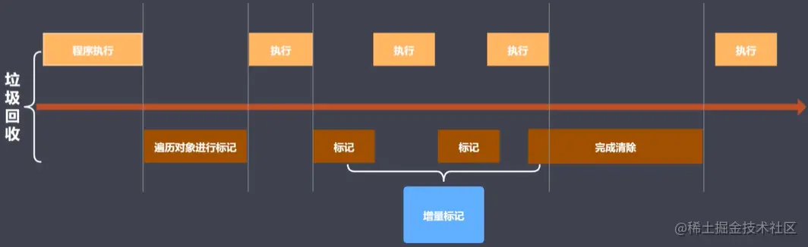

# JS内存管理、性能优化及堆栈

## GC算法介绍

1. 引用计数法
2. 标记清除法
3. 标记整理法
4. 分代回收法

## 引用计数法原理

设置引用计数器。引用关系改变则修改引用计数器。引用为0时则回收。

### 优点

发现垃圾立即回收，最大限度减少程序暂停（时刻监控，引用变化及改变）。

### 缺点

- 无法回收循环引用对象。
- 时间开销大。

## 标记清除法原理

**标记阶段**：遍历所有对象标记对象（从global递归查找）。

**清除阶段**：遍历所有对象清除没有标记的对象，回收相应空间。将回收空间直接放在当前空闲列表上，后面程序可以直接在此申请空间使用。

### 优点

只要在根（global）下不可达，就不需标记（函数局部空间变量与global失去联系）。而在清除阶段就可回收。

### 缺点

- 空间碎片化（空闲链表中的空间不连续，所需大小不符会有碎片产生）。
- 不会立即回收垃圾。

## 标记整理法原理

标记清除的增强版，**标记阶段**与`标记清除法`一致，**清除阶段**会执行整理（移动对象位置，再批量回收）。

### 优点

与标记清除法一样。且不会存在空间碎片化问题。

### 缺点

- 不会立即回收垃圾。

## 分代回收法

将内存区域分为两块，小空间（新生代）用于存储存活时间较短的对象（32位中约为32M，64位中约为64M）。大空间（老生代）用于存储存活时间较长的对象。

新生代回收实现使用了`空间复制`+`标记整理`的算法。老生代回收实现使用了`标记清除`、`标记整理`、`增量标记`算法。

新生代内存区分位两个等大小的空间。活动对象存储于“From空间”。当“From空间”大小超过一定限制时触发GC，进行`标记整理`后拷贝到“To空间”。当“From”与“To”交换空间完成后释放。

老生代在触发GC时，首先使用`标记清除法`完成垃圾空间的回收，若在新生代晋升时老生代空间不足，则采用`标记整理法`进行空间优化。除此之外，还采用`增量标记法`进行优化。

> 注意：使用空间为“From”，空闲空间为“To”，在标记整理后交换空间及状态。
> 注意：拷贝的过程中可能出现晋升。即将新生代都想移动到老生代中。
> 晋升条件：
> 1. 一轮GC过后还存活的新生代需要晋升。
> 2. To空间使用率超过25%需要晋升。

## 界定内存问题的标准

- 内存泄漏：内存使用持续升高，没有下降趋势
- 内存膨胀：当前应用程序为了达到最优的效果，可能需要很大内存空间而设备不能提供。若在多数设备上运行时都存在糟糕的性能体验，则说明程序本身是有问题的。
- 频繁垃圾回收：通过内存变化图进行分析。

## 监控内存的几种方式

- 浏览器任务管理器。
- Timeline时序图记录。
- 堆快照查找分离DOM，分离DOM的存在也就是一种内存上的泄漏。
- 判断是否存在频繁的垃圾回收。

## 参考资料

[万字长文讲解JS内存管理、性能优化以及堆栈](https://juejin.cn/post/7081236724726104101)

